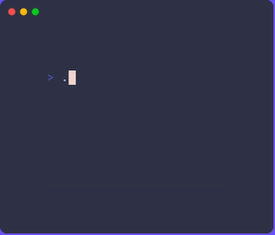

# Aslan Words

This is a library for generating Aslan words according to the guidelines of the awesome [Pirates of Drinax](https://www.mongoosepublishing.com/products/the-pirates-of-drinax?srsltid=AfmBOoq1tbdk_O_QGAK5xoYQc13tXsNSOn8tu5wHto5TOTVtvqMkq-pH) campaign, in the Traveller RPG universe.

## Installation

To install the library into your go project run:

```sh
go get github.com/carloscasalar/aslan-words
```

## Usage

### Library

Here is an example of how to use the library to generate Aslan names:

```go
package main

import (
	"context"
	"fmt"

	"github.com/carloscasalar/aslan-words/pkg/aslanwords"
)

func main() {
	ctx := context.Background()
	word, err := aslanwords.Generate(ctx, aslanwords.WithNumberOfSyllables(3))
	if err != nil {
		fmt.Println("Error generating Aslan word:", err)
		return
	}
	fmt.Printf("Aslan word with 3 syllables: %s\n", word)

	word = aslanwords.MustGenerate(ctx, aslanwords.WithNumberOfSyllablesBetween(3, 6))
	fmt.Printf("Aslan word with between 3 and 6 syllables: %s\n", word)
}
```

## Testing

To run the tests, use the following command:

```sh
make test
```

## CLI

The project includes a basic CLI to generate Aslan names. You can build and run the CLI using the following commands:

```sh
# Build the CLI
make build

# Run the CLI
./out/generate-word --help
```


